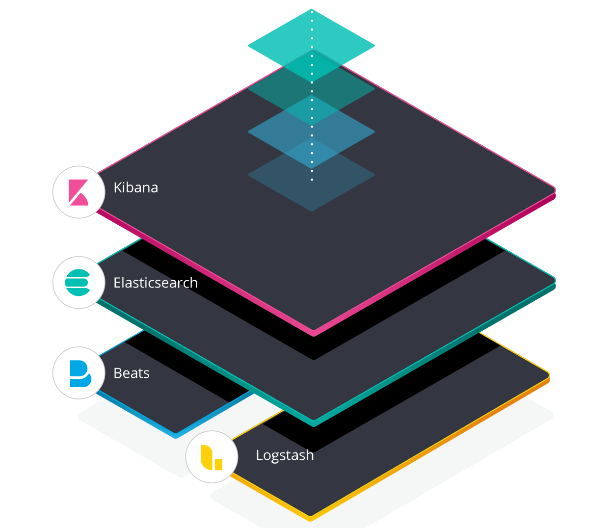

# Elasticsearch-基础介绍及索引原理分析


---

## 问题的起源

### 存储与检索

在千万藏书的图书馆，找一本《21天精通C++》

在《牛津高阶英汉双解词典》中，找到单词*abandon*

---

### 业务最常用的索引-MySQL InnoDB B+ Tree


---

### 新需求-模糊搜索


```mysql
  SELECT * FROM table WHERE name LIKE `str%`;
```

:smile: 索引

```mysql
  SELECT * FROM table WHERE name LIKE `%str%`;
```

:cry: 扫全表

---

### 解决方案

| 方案               | 倒排索引 | 分布式部署 | 写入性能 |
| ------------------ | -------- | ---------- | -------- |
| MySQL 5.7 全文索引 | :blush:  |            |          |
| Elasticsearch      | :blush:  | :blush:    | :blush:  |

业界选择ES提供搜索服务的部分公司：

腾讯云、阿里云、微软、GitHub、Facebook、Netflix、Uber等

---

## ES的前世今生

>伦敦的公寓内，Shay Banon 正在忙着寻找工作，而他的妻子正在烹饪学校学习厨艺，为了给他的妻子做一个食谱搜索引擎，他开始使用 **Lucene** 的一个早期版本。
>Lucene有学习门槛，因此 Shay 开始做一个抽象层，2004年他做出 **Compass**。2010年，支持分布式，并且提供RESTful接口，这个版本就是 **Elasticsearch**。

---

## ES的应用场景

* 搜索后端

* 可观测性（ELK 系统）



---

## Elasticsearch 特性

* 基于Lucene倒排索引

* 提供RESTful API

* 分布式

---

## Lucene


Java写的全文检索和搜索库，由Apache软件基金会支持

基于Lucene的知名项目：

Solr， Elasticsearch等

---

### 啥是倒排索引？

* 正排索引

| key    | value      |
| ------ | ---------- |
| 静夜思 | 床前明月光 |

* 倒排索引

| key | value  |
| --- | ------ |
| 床  | 静夜思 |
| 前  | 静夜思 |
| ... | ...    |

---


---


---

### 海量数据下，map怎样实现？

| 数据结构 | 搜索时间复杂度 |
| -------- | -------------- |
| 哈希     | O(1)           |
| 红黑树   | O(logn)        |
| 跳表     | O(logn)        |
| 前缀树   | O(k)           |
| FST      | O(k)           |

---

### 预备知识：有限状态机

（FSM Finite State Machine）


---

### TCP - FSM


---

### Trie


---

### FST (Finite State Transducer) 有限状态转换器

* 共享前缀

* 共享后缀

* 无环

* Transducer : input -> output

---

### FST

"october", "november", "december"


---

### Posting List 压缩 -- Frame of Reference


---

### Posting List 取交集 -- 跳跃表


---

### Posting List 取交集 -- Roaring Bitmaps


---

## RESTful API

表现层状态转换（Representational State Transfer）

简单来说：

* URL 定位资源
* Method 描述操作

```text
GET /my-index-000001
```

---

## 分布式


---

### 概念

* Cluster ES集群
* Node 单个ES实例
* Index Document的集合
* Type 理解为MySQL的表
ES 6.0 一个Index只允许一个Type
8.0 type被删除
* Document 理解为MySQL的行
* Shard 分片，存放Index
* Replica 副本


---

### 分布式引来的其他问题

* 高可用，主备，主结点挂掉，选举问题

* 一致性

---

## Thanks
